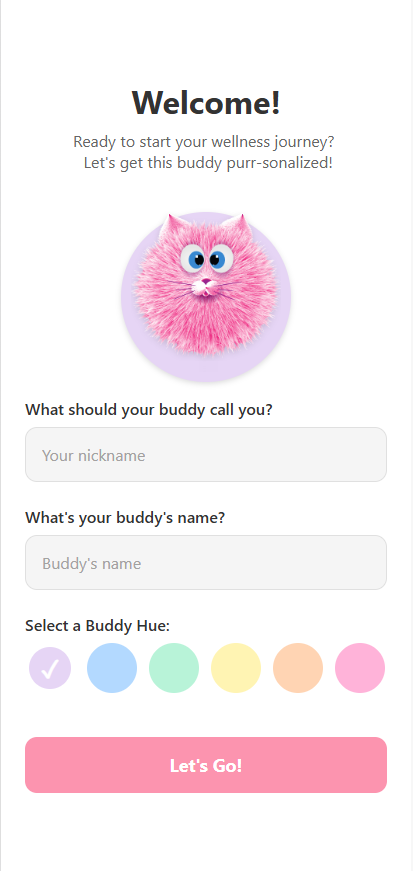
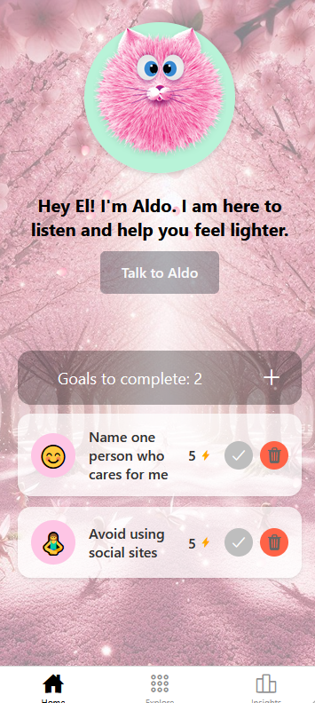
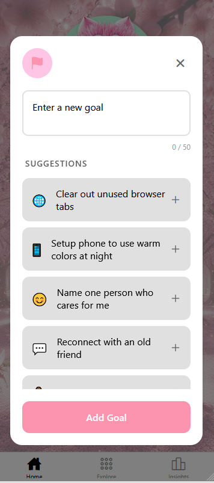
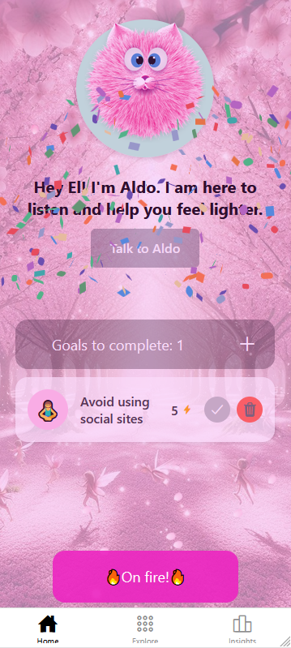
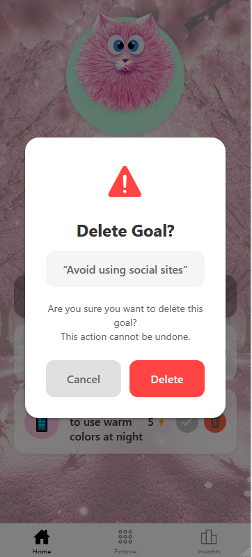
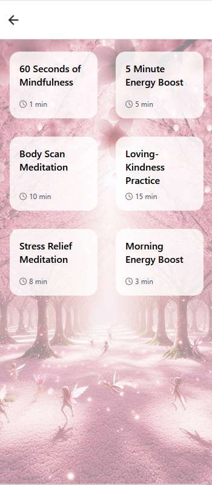
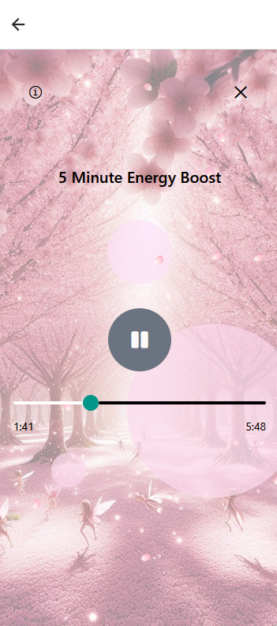
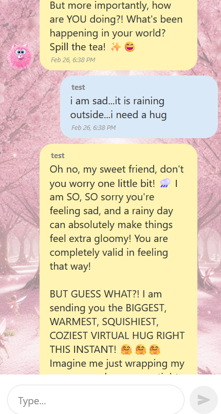

# Academic-Toolkit
#### Here you will find exercises, projects that were conducted as part of studying at VIA University College 
_(Tip: Ctrl/Cmd + Click to open in a new tab)_
## Ba Eng Project: self-care Expo app "Catico"
Hey, traveler! [I am officially deployed!](https://self-care-app-v2-1-nzzl.vercel.app) 
- Just a heads-up: I’m currently living on free-tier services, so it might take a moment for the server and database to wake up. 

I’m also still being polished 🤩, so stay tuned for more updates soon.

* **My tech stack:** Expo, TypeScript, GraphQL, MongoDB, Apollo Server.
* **What I do:** I allow users to choose the Buddy's aura and name. I also welcome them to create, delete, and complete goals to help them build habits. I celebrate completed goals with a confetti animation. I also provide a space to emotionally vent through a chat feature connected to AI and to listen to guided meditation.

**Meanwhile, this is how I look:**

  
  
  
  
  
  
  
    
 

## Multimedia
- [A Surreal Journey. Multimedia Project.](https://youtu.be/_jBNDwUpEh8) - Video

## JS, React
- [ELGANTE Personal Site](https://elgante-personal-site-v1.vercel.app) -  Demo
- [ELGANTE Personal Site](https://github.com/elgante/elgante_personal_site_v1_code.git) - Built independently to explore JavaScript and React features.
- [WEB2 assignment Pokedex](https://pokedex-nine-gamma-91.vercel.app) - Demo
- [WEB2 assignment Pokedex](https://github.com/elgante/pokedex_code) - Code
- [WEB2 assignment Tic-Tac-Toe](https://github.com/elgante/tic_tac_toe) - Group work - Code
- [Semester 4 Project: Green House. ](https://plan-ty.github.io/plan-ty/) - Responsive Web Solution, React, JS,  Chart.js, Axios,  Testing(Jest, Cypress), CI/CD - Group work - Demo

## C#
- [.NET Assignments 1-3](https://github.com/elgante/.NETassignment1-3) - Code 
- [Semester 3 Project: CenterSprog Language School](https://youtu.be/oUpRkwiyLQY) - Demo
- [Semester 3 Project. Distributed Systems. ](https://github.com/elgante/3rdSemesterProject) - 3 Tier: CenterSprog Language School. .NET, Java Sring Boot, Blazor, gRPC, Rest API, SQL - Group work - Code

## Java
- [Semester2 Project. Client-Server: Vynil Swap.](https://github.com/elgante/SEP2_group_work) - JavaFx+RMI - Group work - Code
- [Java exercises and Semester1 Project: Overlook Hotel.](https://github.com/elgante/java) - JavaFx - Group work - Code
- [WEB1 Assignment: Overlook Hotel Website.](https://overlookhotel.vercel.app/) - HTML, CSS, Bootstrap - Group work - Demo

